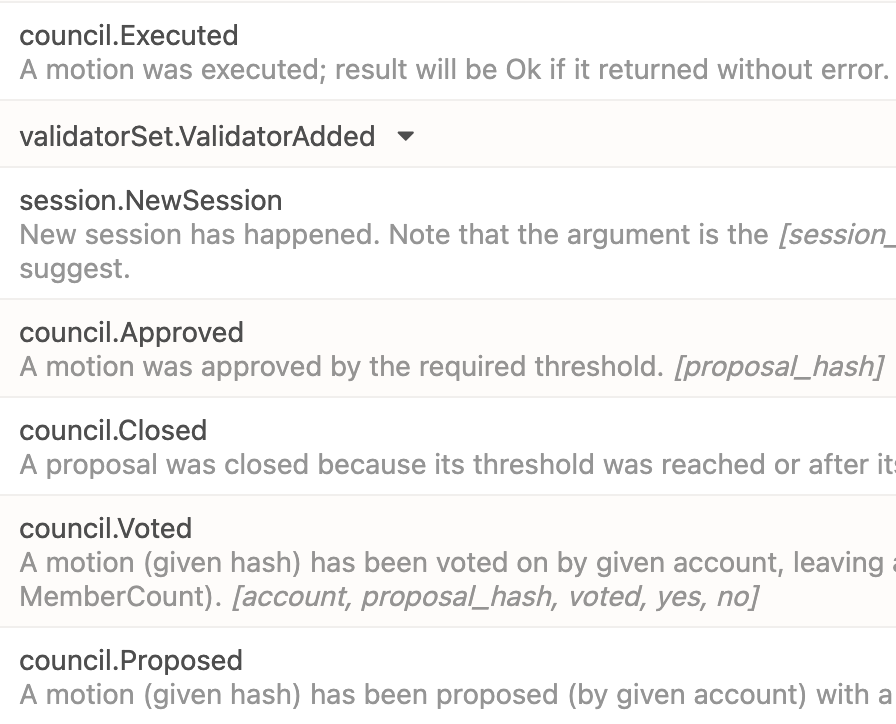

# How to use the Validator Set pallet with Collective pallet as origin

## Setup

1. Import and declare the `Collective` pallet in your runtime. Make sure to import the required traits.

```rust
parameter_types! {
	pub const CouncilMotionDuration: BlockNumber = 3 * MINUTES;
	pub const CouncilMaxProposals: u32 = 100;
	pub const CouncilMaxMembers: u32 = 100;
}

impl pallet_collective::Config for Runtime {
	type Origin = Origin;
	type Proposal = Call;
	type Event = Event;
	type MotionDuration = CouncilMotionDuration;
	type MaxProposals = CouncilMaxProposals;
	type MaxMembers = CouncilMaxMembers;
	type DefaultVote = pallet_collective::PrimeDefaultVote;
	type WeightInfo = pallet_collective::weights::SubstrateWeight<Runtime>;
}
```

2. Setup a custom origin using the `Collective` pallet. In the example below, we have a custom origin that ensures either root or at least half of the collective's approval. 

```rust
type EnsureRootOrHalfCouncil = EnsureOneOf<
	AccountId,
	EnsureRoot<AccountId>,
	pallet_collective::EnsureProportionAtLeast<1, 2, AccountId>
>;
```

3. Configure the custom origin for the Validator Set pallet.

```rust
impl validator_set::Config for Runtime {
	type Event = Event;
	type MinAuthorities = MinAuthorities; // see readme for type declaration
	type AddRemoveOrigin = EnsureRootOrHalfCouncil;
}
```

4. Add genesis config for the `Collective` pallet to initialize some members in the collective when the chain starts. In the example below, the initial authorities are also the collective members. (The `Collective` pallet's default instance is named as council here.)

```rust
council: CouncilConfig {
    members: initial_authorities.iter().map(|x| x.0.clone()).collect::<Vec<_>>(),
    phantom: Default::default(),
},
```

For rest of the setup steps, see [readme.md](../readme.md).

## Run

Before running - Alice and Bob are set as initial authorities and also as council members.

- Start the chain in the `local_testnet` mode with the non-validator (--charlie) first (so it take the default port and connects with the Polkadot JS web app).
- Start `--alice` and `--bob` nodes too.
- Alice and Bob will produce blocks and Charlie will only import them as it is not a validator yet.
- From Charlie's node connected web app instance, make an RPC call `author - rotate_keys`. This will print session keys for Charlie node.
- Use this printed string in the step 4 and make an extrinsic call from `Charlie` account - `Session - set_keys`. Put 0x in the proof input.
- Now start the council flow. From `Alice` propose a motion to add Charlie as a validator using the validator-set pallet.
- From `Bob` account, vote and approve this proposal.
- Wait for the voting period to end. Close the motion using `Alice` account.
- The motion will execute and `Charlie` will be added as validator. (see screenshot below)

<br />
