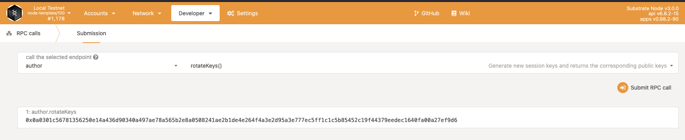
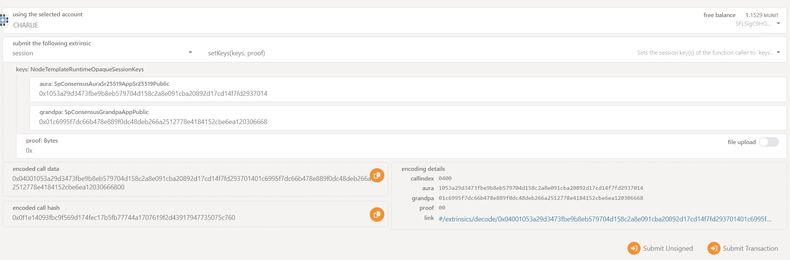
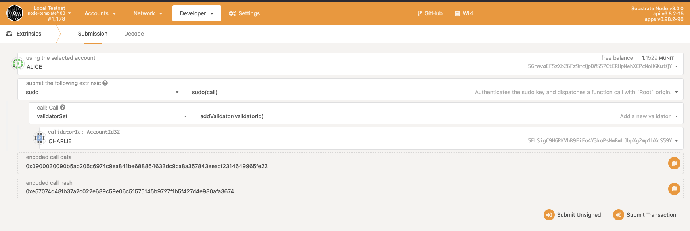

# Local network setup for testing Validator Set pallet

If you are using the Substrate node template and want to set up a local network to test/use the validator set pallet, follow the steps below. Make sure you have completed all the steps in the [readme.md](../readme.md) before doing this.

## Local Network

Once your node template compiles after adding the validator set pallet, the first thing we need to do is run at least 3 nodes as a local network.
The node template comes with two predefined chain configurations - `dev` and `local`. We will be using the local config that already has two values in the `initial_authorities` genesis config. These are accounts generated using the dev seed for `Alice` and `Bob`.

### Step 1

Run the `Alice` validator:

```bash
./target/release/node-template --chain=local --alice --base-path /tmp/a --port=30334 --ws-port 9944 --ws-external --rpc-cors=all --rpc-methods=Unsafe --rpc-external
```

Note that we have provided --chain=local, and custom values for base-path, port, ws-port. These custom value are used to avoid conflicts when running all nodes on local machine. If you are running nodes on separate servers, you can leave these as defaults.

The remaining parameters `--ws-external --rpc-cors=all --rpc-methods=Unsafe --rpc-external` are used to connect ws and rpc from a remote machine, and to allow rpc calls. For production setup, this should be double-checked, and only allowed if required. Do not use these as-is for production nodes.

### Step 2

Next, once the `Alice` node starts, copy it's node address from the console logs:

```bash
Local node identity is: 12D3KooWQXBxhGvmbcb8siLZWf7bNzv3KrzEXhi9t2VbDGP57zR9
```

In this case, `12D3KooWQXBxhGvmbcb8siLZWf7bNzv3KrzEXhi9t2VbDGP57zR9` is the node identity. We will need this as the bootnode address for other nodes.

### Step 3

Next, run the `Bob` and `Charlie` nodes:

```bash
./target/release/node-template --chain=local --bob --base-path /tmp/b --port=30335 --ws-port 9945 --ws-external --rpc-cors=all --rpc-methods=Unsafe --rpc-external --bootnodes /ip4/127.0.0.1/tcp/30334/p2p/12D3KooWQXBxhGvmbcb8siLZWf7bNzv3KrzEXhi9t2VbDGP57zR9
```

and,

```bash
./target/release/node-template --chain=local --charlie --base-path /tmp/c --port=30336 --ws-port 9946 --ws-external --rpc-cors=all --rpc-methods=Unsafe --rpc-external --bootnodes /ip4/127.0.0.1/tcp/30334/p2p/12D3KooWQXBxhGvmbcb8siLZWf7bNzv3KrzEXhi9t2VbDGP57zR9
```

As you can see, we have added an additional parameter when running `Bob` and `Charlie` nodes to provide a bootnode. The bootnodes parameter has the `Alice` node's identity. You should replace it with what you get in Step 2 above.

### Step 4

Open Polkadot JS Apps in your browser and connect it to the `Charlie` node using its ws endpoint. In this case, it would be: `ws://127.0.0.1:9946`. Remember we used a custom `ws-port`.
In the Network Explorer you should see that `Alice` and `Bob` are producing blocks, while `Charlie` is not. This is because `Charlie` is not part of initial authorities from genesis config. 

### Step 5

From `Charlie` node connected Polkadot JS Apps instance, make an RPC call `author - rotate_keys`. This will print public session keys for `Charlie` node.

<br />


### Step 6

Now make an extrinsic call from `Charlie` account - `Session - set_keys`.
Use the string obtained in Step 5 above in the `keys: NodeTemplateRuntimeOpaqueSessionKeys` input. Enter the same value if you see multiple input fields grouped under keys (aura, grandpa, imonline).
Put `0x` in the `proof` input.

<br />


### Step 7

Finally, add `Charlie` as a validator by calling the `add_validator` extrinsic of the Validator Set pallet using `sudo`. Alice is set as the sudo key in node template.

<br />


### Step 8

Go to the Network Explorer page in Polkadot JS Apps and note the session number. After two sessions from this, the `Charlie` node should start authoring blocks and you should be able to see under the recent blocks list on the same page.

Following these steps, you can add more validators.
